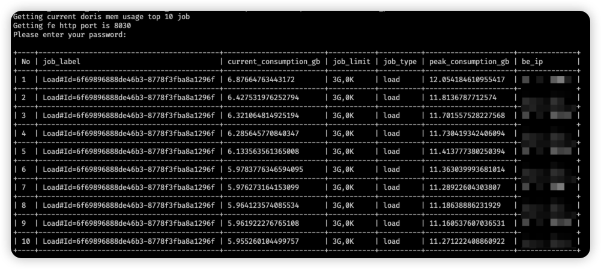

# doris_resource_topN

- 工具是用来发现当前doris 或者sr job或者query 的job 占用内存的topN
- 编译后的命令：doris_resource_topN --num 10 --fe_host "10.xx.xx.1,10.xx.xx.2,10.xx.xx.3" --fe_port 8030
- 输入root 用户密码
  

# test doris ver
- 1.2.7
- 2.1.3

